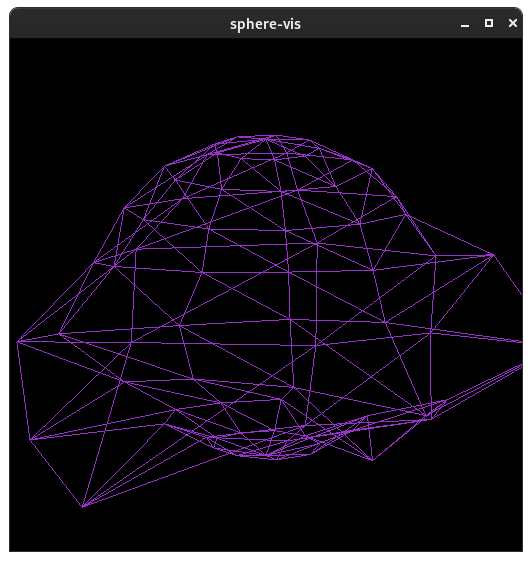

# sphere-vis
`sphere-vis` is a  visualiser that displaces the vertices on a sphere in sync with the music/sounds.



## Compiling
### Build time dependencies
The current version of `sphere-vis` will compile and statically link glfw and portaudio, as such the following system packages are necessary:
* libX11 development files
* libXrandr development files
* libXinerama development files
* libXcursor development files
* libXi development files
* libGL (mesa) development files
* alsa library development files
* cmake
* make
* a C++17 compiler

[install-dependencies-fedora.sh](scripts/install-dependencies-fedora.sh) is a script that will install the dependencies mentioned above, for Fedora (tested only on Fedora 32).

### How to build
```sh
git clone https://github.com/alexge50/sphere-vis
cd sphere-vis
git submodule update --init --recursive
mkdir build && cd build
cmake -DCMAKE_BUILD_TYPE=Release -G "Unix Makefiles" ..
cmake --build . --target sphere-vis
cmake --build . --target sphere-vis -- -j N # or use this for compiling on multiple threads, replace N with the number of threads that you want to use
```

After building is done a `sphere-vis` binary will become available - you can copy this into a convenient location.

## Configuration
`sphere-vis` is looking for a configuration file located at `~/.config/sphere-vis/conf.toml` or the config file can be passed as a parameter, as follows:
```sh
sphere-vis /path/to/config/file
``` 

Although untested, `sphere-vis` should work on Windows, and if the program is run on Windows, it expects to config file to be passed as an argument.

### Config file
The config file format is TOML, and an example of the default settings can be found in [default.toml](config/default.toml).

```toml
[audio]
sample_rate=44100 # the sample rate at which the audio is sampled
frames_per_buffer=128 # how many samples should be processed at a time (lowering this number will increase "real-timeness", however the CPU usage as well)
amplify=1.0 # the audio data is multiplied by this number

[sphere]
rings=10 # number of rings (parallels) that the displayed sphere has
sectors=10 # number of sectors (medians) that the displayed sphere has

[colors]
background=[0, 0, 0] # the color of the background
foreground=[153, 50, 204] # the color of the sphere
```